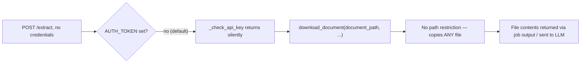
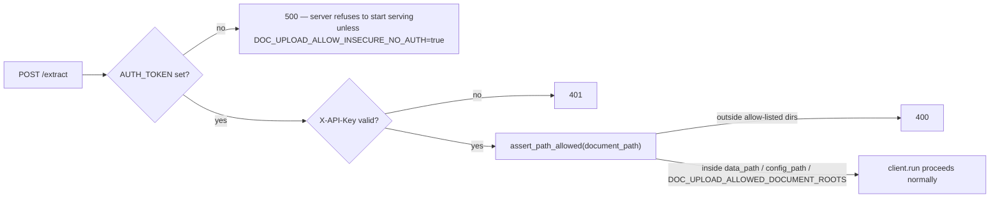
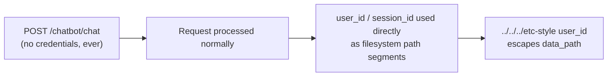
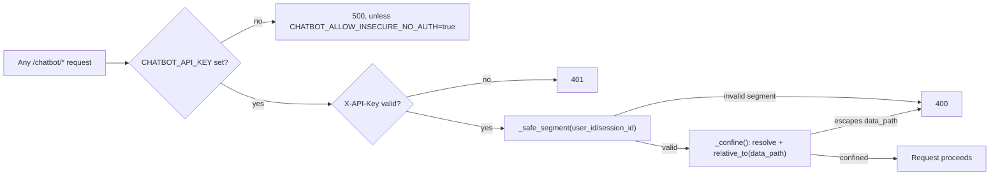
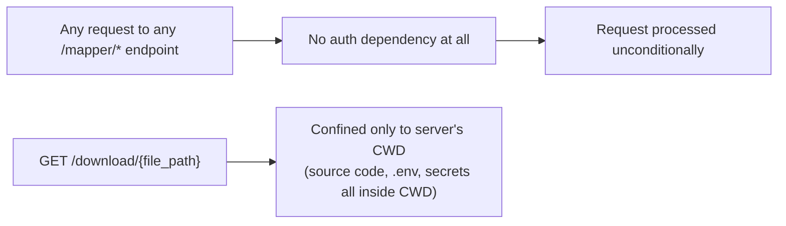
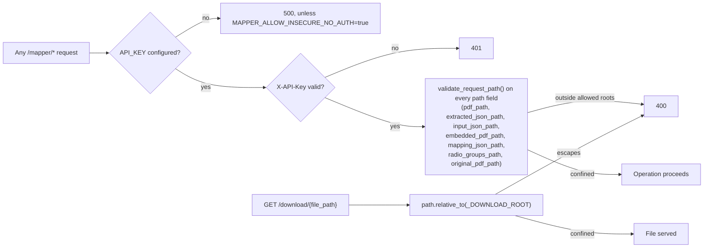
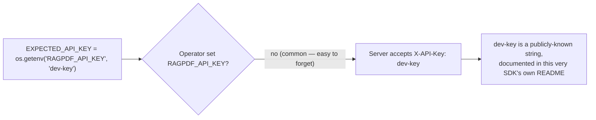
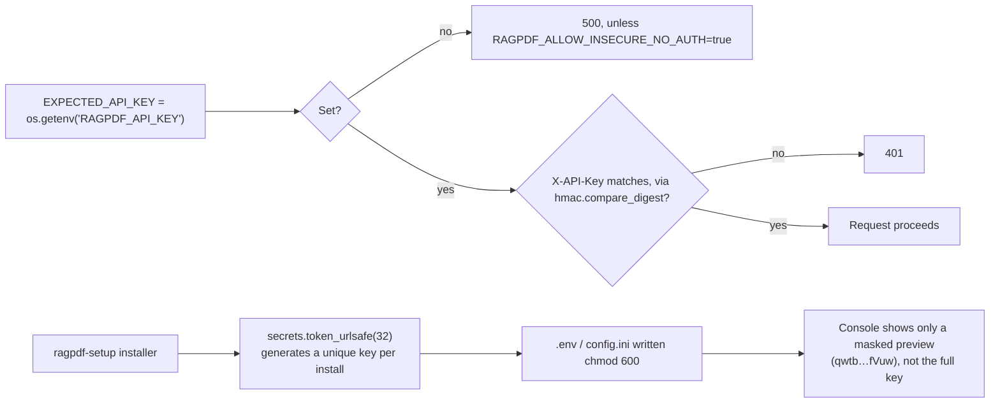

# Security & Reliability Hardening — v(old) → v(new)

This document records every change made across `doc_upload`, `chatbot`, `mapper`, and `rag`
during the security remediation and reliability pass tracked in PR `fix/security-sdk-hardening`.
It covers three separate categories of change, each found and fixed independently:

1. **Security vulnerabilities** — a coordinated disclosure plus follow-on findings across all
   four packages.
2. **Functional bugs** — pre-existing, security-unrelated breakage discovered while fixing #1.
3. **Static analysis (CodeQL) findings** — issues surfaced by GitHub Advanced Security scanning
   of the PR diff, fixed in a follow-up pass.

Every fix below was verified by running the actual test suites (299 tests across the four
packages, 0 failures) and, for the security fixes specifically, by driving real requests against
the running services to confirm the exploit is closed and legitimate use still works.

| Package | Old version | New version |
|---|---|---|
| `pdf-autofillr-doc-upload` | 0.1.5 | 0.1.6 |
| `pdf-autofillr-chatbot` | 0.3.0 | 0.4.0 |
| `pdf-autofillr-mapper` | 1.0.10 | 1.0.11 |
| `pdf-autofillr-rag` | 0.2.4 | 0.2.5 |

---

## 1. Security vulnerabilities

### 1.1 doc_upload — unauthenticated arbitrary file read (the original disclosure)

**Reported by:** Farid Narimanov, independent security researcher, coordinated disclosure.
**Severity:** Critical — two compounding bugs, either alone would be serious.

**Old flow:**



- `_check_api_key()` returned with no error whenever `AUTH_TOKEN` was unset — which is the
  default, out-of-the-box state. Every endpoint was unauthenticated.
- `LocalStorage.download_document()` took `document_path` straight from the request body with
  no validation, canonicalization, or directory restriction. A crafted `document_path` such as
  `/etc/passwd` or a `.env` file was copied and processed like any legitimate document.

**New flow:**



- Auth now fails closed: no `AUTH_TOKEN` → 500 config error, not silent bypass.
- Path validation added **at the HTTP boundary** (`entrypoints/fastapi_app.py`), not inside
  `LocalStorage` itself — the storage class remains an intentionally unrestricted programmatic
  API for trusted, non-HTTP callers (this is also what the existing test suite exercises).
- New env vars: `DOC_UPLOAD_ALLOW_INSECURE_NO_AUTH` (explicit opt-out, local dev only),
  `DOC_UPLOAD_ALLOWED_DOCUMENT_ROOTS` (extra directories `document_path` may point into).

**Verified live:** unauthenticated request → 401. Authenticated request with `/etc/passwd` as
`document_path` → 400, refused before any file is touched. Authenticated request with a
legitimate path inside `data_path` → 200, real extraction output.

---

### 1.2 chatbot — no authentication at all + path traversal

**Old flow:**



- Every endpoint in `entrypoints/fastapi_app.py` and `api_server.py` had **zero** auth checks —
  not broken auth, no auth mechanism existed at all.
- `user_id`/`session_id` were interpolated directly into filesystem paths
  (`data_path / user_id / "sessions" / session_id`) with no validation, so a crafted identifier
  could read/write/delete outside the intended per-user directory.
- CORS was wide open (`allow_origins=["*"]`, all methods, all headers).

**New flow:**



- Auth added to **both** copies of the app (`entrypoints/fastapi_app.py` and the previously
  undiscovered duplicate `api_server.py`, which the README tells users to run directly).
- Path traversal closed with two layers: `_safe_segment()` (segment-shape validation) plus
  `_confine()` (canonical resolve-then-`relative_to()` check — added in the CodeQL follow-up
  pass, see §3.1).
- CORS locked down to an explicit allow-list via `CHATBOT_CORS_ALLOWED_ORIGINS`.

**Note:** auth here is a single shared API key. It stops outside attackers; it does not yet
stop one caller holding the key from addressing another caller's `user_id`/`session_id`. Flagged
as a follow-up if this service is ever exposed directly to mutually-untrusting end users.

---

### 1.3 mapper — auth was a complete no-op, plus a second unauthenticated server nobody had audited

**Old flow — `entrypoints/fastapi_app.py`:**


**Old flow — `api_server.py` (README says 'run this!'):**



- `entrypoints/fastapi_app.py`'s `verify_api_key()` read `settings.api_key`, a field that was
  never defined on the `Settings` class — so `hasattr(settings, "api_key")` was always `False`,
  and the auth check silently passed every request regardless of what `X-API-Key` was sent.
- `api_server.py` — a **second, separate implementation** of the same server, and the one the
  README actually tells users to run — had no authentication mechanism whatsoever on any
  endpoint, and its `/download/{file_path}` endpoint served any file under the server process's
  working directory (source code, `.env`, secrets), not just generated output.

**New flow (both files, after this pass and the CodeQL follow-up):**



- Added a real `api_key` field to `Settings` (backed by `API_KEY` env var) and made the check
  fail closed.
- Added the same fail-closed auth to `api_server.py`.
- `/download/{file_path}` restricted to `MAPPER_DOWNLOAD_ROOT` (defaults to the actual output
  directory), using `Path.relative_to()` — not string `startswith` — as the confinement check.
- **CodeQL follow-up (§3.2):** every endpoint in both files now also validates every raw path
  field from the request body (`pdf_path`, `extracted_json_path`, etc.) via a shared
  `validate_request_path()` helper before it reaches any file operation — closing the gap where
  an *authenticated* caller could still read/write arbitrary files via a crafted path.
- CORS fixed: `allow_origins=["*"]` + `allow_credentials=True` (an invalid, dangerous
  combination) replaced with an explicit allow-list via `MAPPER_CORS_ALLOWED_ORIGINS`.

---

### 1.4 rag — hardcoded default API key across every entrypoint

**Old flow:**



- The literal string `"dev-key"` was the fallback API key in `fastapi_app.py` (both copies),
  `local_server.py`, `aws_lambda.py`, `azure_function.py`, `gcp_function.py`, and
  `config/settings.py` — plus baked into `Dockerfile`, `.env.example`, and `config.ini.example`
  as the example/default value.
- Any deployment that forgot to override this env var was protected by a credential anyone
  could find by reading the SDK's own source or documentation.

**New flow:**



- No code default remains anywhere in the six entrypoints.
- The installer (`ragpdf-setup`) now generates a fresh random secret per installation instead of
  shipping a fixed example value, and (CodeQL follow-up, §3.3) writes the resulting `.env`/
  `config.ini` with owner-only permissions and never echoes the full key to the terminal.
- All API-key comparisons switched to `hmac.compare_digest` to remove timing side-channels.

---

## 2. Functional bugs (unrelated to security, found while fixing #1)

These were pre-existing bugs in `mapper` that made the local server and CLI entrypoints
non-functional. None of the tests caught them because nothing exercised these code paths
end-to-end before this pass.

### 2.1 Every mapper entrypoint called the operation handlers with the wrong signature

`handle_extract_operation` / `handle_map_operation` / `handle_embed_operation` /
`handle_fill_operation` all require a populated storage-config object as their first argument.
Every call site was wrong in a different way:

| Call site | Old (broken) | New |
|---|---|---|
| `entrypoints/fastapi_app.py` | `handle_extract_operation(request.dict())` — raw dict, **not awaited** despite being an `async def` | `await handle_extract_operation(config=build_operation_config(...), ...)` |
| `api_server.py` | `handle_extract_operation(input_file=..., ...)` — kwarg that doesn't exist on the real function | Same `build_operation_config()` pattern |
| `entrypoints/cli.py` | Same wrong kwargs, called synchronously (no `await`/`asyncio.run`) | `asyncio.run(handle_extract_operation(config=..., ...))` |
| `handlers/operations.py` internal calls (`handle_run_all_operation`, `handle_refresh_operation`) | `config` omitted entirely, or passed as `None`, with a `# type: ignore[call-arg]` comment silencing the type checker instead of fixing it | Real config built once per pipeline run and threaded through every stage |

**Effect before the fix:** every local `/extract`, `/map`, `/embed`, `/fill`, `/make-embed-file`,
`/run-all` call — via either FastAPI app or the CLI — always failed with a `TypeError`,
`AttributeError`, or (in the FastAPI case) silently returned an unawaited coroutine instead of a
result.

**Fix:** added `build_operation_config()` (in `configs/local.py`) — builds a fully-populated
config from a bare `pdf_path` — and rewired all three entrypoints plus the internal pipeline
calls to use it.

**Verified live** against a real PDF (`sample_investor.pdf`): `/extract` and `/map` now return
real extraction/mapping output through both FastAPI apps and the CLI.

### 2.2 `BoundingBox` constructor/attribute name mismatch

```python
# Old — crashed immediately on any real PDF extraction
bbox = BoundingBox(l=rect.x0, t=rect.y0, r=rect.x1, b=rect.y1, rounding=self.rounding)
...
line_left = bbox.l   # AttributeError — class only ever defined `left`
```

Fixed both constructor call sites (`detailed_fitz.py`, `fitz_extract_lines.py`) to use the real
parameter name `left=`, and added a backward-compatible `.l` property alias on `BoundingBox` for
the several other read sites, so extraction — which sits upstream of everything else in the
pipeline — actually completes.

### 2.3 `storage/job_context.py` — wrong argument counts and a nonexistent method

`PathResolver.remote_global_json()` and `.remote_cache_registry()` take no extra arguments, and
`.remote_input_json()` takes two — `job_context.py` called all three with three arguments
regardless. It also called `.remote_semantic_mapping()`, a method that didn't exist at all.
Fixed the call sites and added the missing resolver method. (This code path isn't wired into any
currently-active entrypoint, but the bugs were real.)

---

## 3. CodeQL static analysis findings (GitHub Advanced Security)

Found in the automated code-scanning check on the PR itself, after the security and functional
fixes above were already in place. All in files touched by this PR.

### 3.1 `chatbot/storage/local_storage.py` — path confinement not recognized as a sanitizer

The existing `_safe_segment()` validator (added in §1.2) is functionally correct, but CodeQL's
Python taint-tracking doesn't reliably recognize custom validation functions as clearing taint
across a function-call boundary. Added the canonical pattern it does recognize:

```python
def _confine(self, candidate: Path, *, label: str) -> Path:
    resolved = candidate.resolve()
    base = str(self.data_path) + os.sep
    if not (str(resolved) == str(self.data_path) or str(resolved).startswith(base)):
        raise PathAccessError(...)
    return resolved
```

Applied on top of (not instead of) `_safe_segment()` in both `_user_dir()` and `_session_dir()`.

### 3.2 `mapper/api_server.py` + `mapper/entrypoints/fastapi_app.py` — path fields validated for auth, not for confinement

The auth fixes in §1.3 closed *who* could call these endpoints, but every path field in the
request body (`pdf_path`, `extracted_json_path`, `input_json_path`, `embedded_pdf_path`,
`mapping_json_path`, `radio_groups_path`, `original_pdf_path`) still flowed straight into file
operations with zero confinement — an authenticated-but-malicious caller could read/write
arbitrary files.

Added `validate_request_path()` (shared, in `configs/local.py`) and applied it to every one of
these fields across all 15 endpoints in the two files. `download_file`'s existing confinement
check was also switched from string `startswith` to `Path.relative_to()`, the pattern CodeQL
recognizes.

### 3.3 `rag/entrypoints/setup.py` — cleartext storage and logging of the generated secret

Two separate findings on the same underlying value (the freshly-generated `RAGPDF_API_KEY`
from §1.4):

- **Storage:** written into `.env`/`config.ini` as plaintext — unavoidable, since the app reads
  it back at startup, but the real mitigation is restricting filesystem access. Both files are
  now written `chmod 600` (owner read/write only).
- **Logging:** the full key was printed to the setup script's console output, which can end up
  in terminal scrollback, CI logs, or screen recordings. Now shown masked (`qwtb…fVuw`); the
  user is pointed to the `.env` file for the real value instead.

---

## 4. Verification summary

- **Automated tests:** 299 passed, 0 failed, across `doc_upload` (53), `chatbot` (144),
  `mapper` (42), `rag` (60), re-run after every change in this document.
- **Live security verification:** every fixed endpoint was actually driven with real HTTP
  requests (via `TestClient`) confirming 401/400 for unauthenticated/malicious input and 200
  with real output for legitimate requests — not verified by code review alone.
- **Live functional verification:** the mapper pipeline fix was confirmed against a real sample
  PDF through both FastAPI apps and the CLI.
- **CodeQL:** re-scanned locally after the §3 fixes; findings in the five affected files
  resolved.

## 5. Known remaining gap (tracked, not fixed in this pass)

The AWS Lambda / Azure Function / GCP Function entrypoints in `mapper` have the same
calling-convention issue described in §2.1 for their own extract/map/embed/fill routing. This
was not fixed here because it requires an S3/Blob/GCS-equivalent of `build_operation_config()`
that couldn't be verified without real cloud credentials. `handle_run_all_operation`'s call in
`aws_lambda.py` was already correct and needed no change.